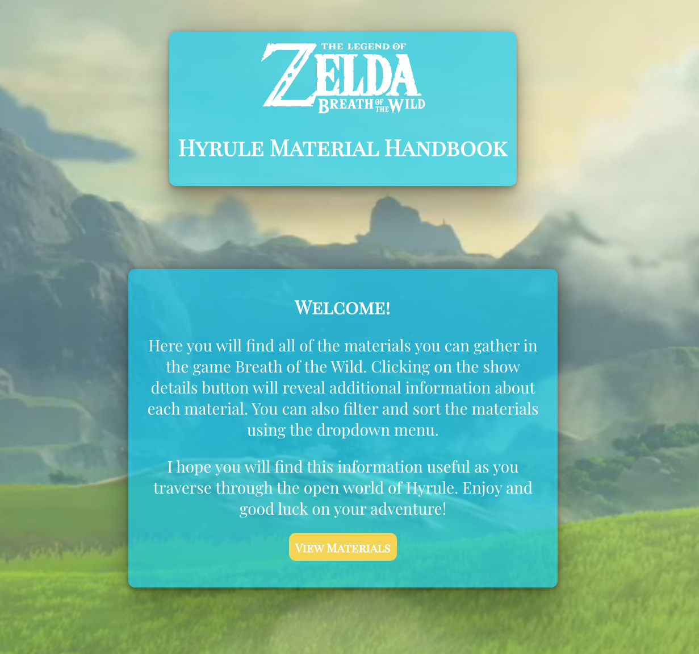
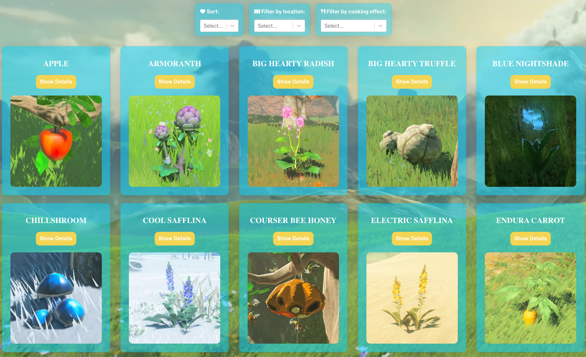

# Hyrule Material Handbook

[See the app in action!](https://hyrule-material-handbook.netlify.app/)

## Description

This app is an index of the gatherable materials featured in Legend of Zelda: Breath of the Wild. With features like sorting and filtering, a user can easily determine what a material is and where to find it. All material information is collected using the [Hyrule Compendium API](https://gadhagod.github.io/Hyrule-Compendium-API/#/).

## Technologies Used

## Screenshots

## Getting Started

[Check out the app here!](https://hyrule-material-handbook.netlify.app/) Upon loading, you will see a home page where you can navigate to the materials. All materials will be shown in alphabetical order. You can click on a material's "Show Details" button to view its details. If you would like to sort or filter the materials, you can do so using the dropdown menus that are beneath the navigation bar.

If you would like to run the application locally, you can do so by [cloning](https://docs.github.com/en/repositories/creating-and-managing-repositories/cloning-a-repository) it onto your device. You would then need to run the command `npm i` to download the necessary packages. After that run `npm start` to run the application locally.

## Contribution Guidelines

If you have an idea to improve the application, I would love to see it! Feel free to [fork](https://docs.github.com/en/get-started/quickstart/fork-a-repo) the repository and create a [pull request](https://docs.github.com/en/pull-requests/collaborating-with-pull-requests/proposing-changes-to-your-work-with-pull-requests/creating-a-pull-request) with any updates you've made. As mentioned above, don't forget to run `npm i` to download all packages.

## Future Enhancements

- Allow users to search for materials by name.
- Add more pages featuring monsters, creatures, and equipment.
- Add pages for the newly released Legend of Zelda: Tears of the Kingdom.
